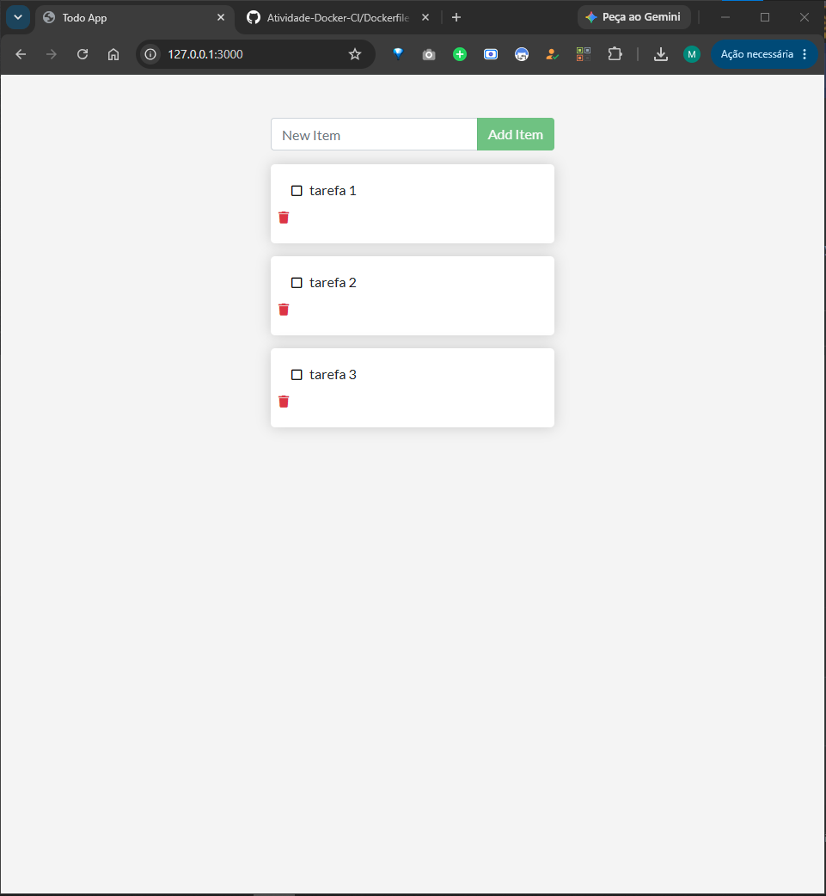
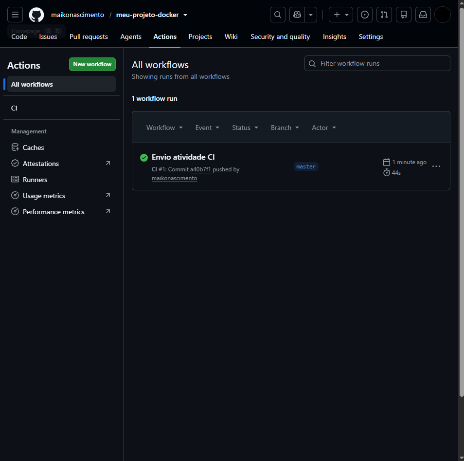
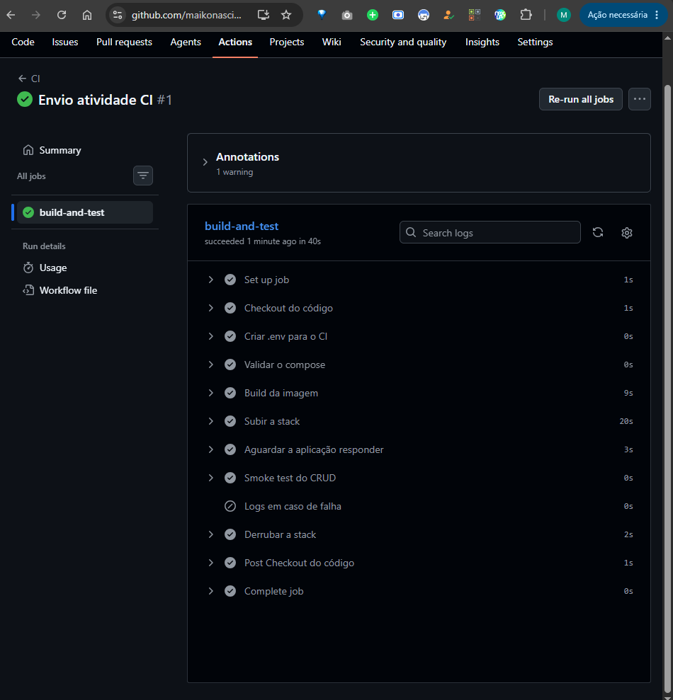
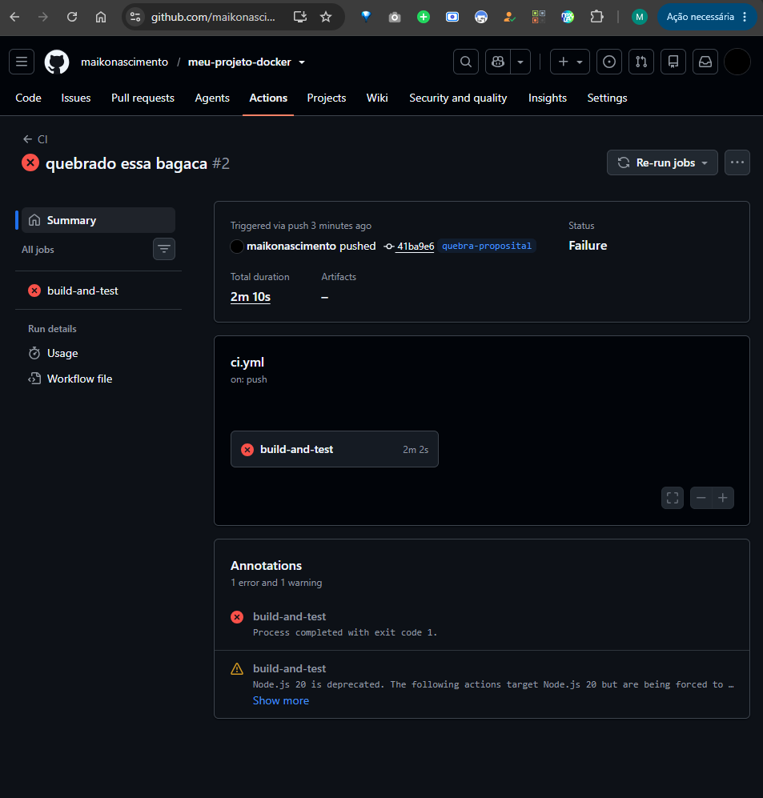
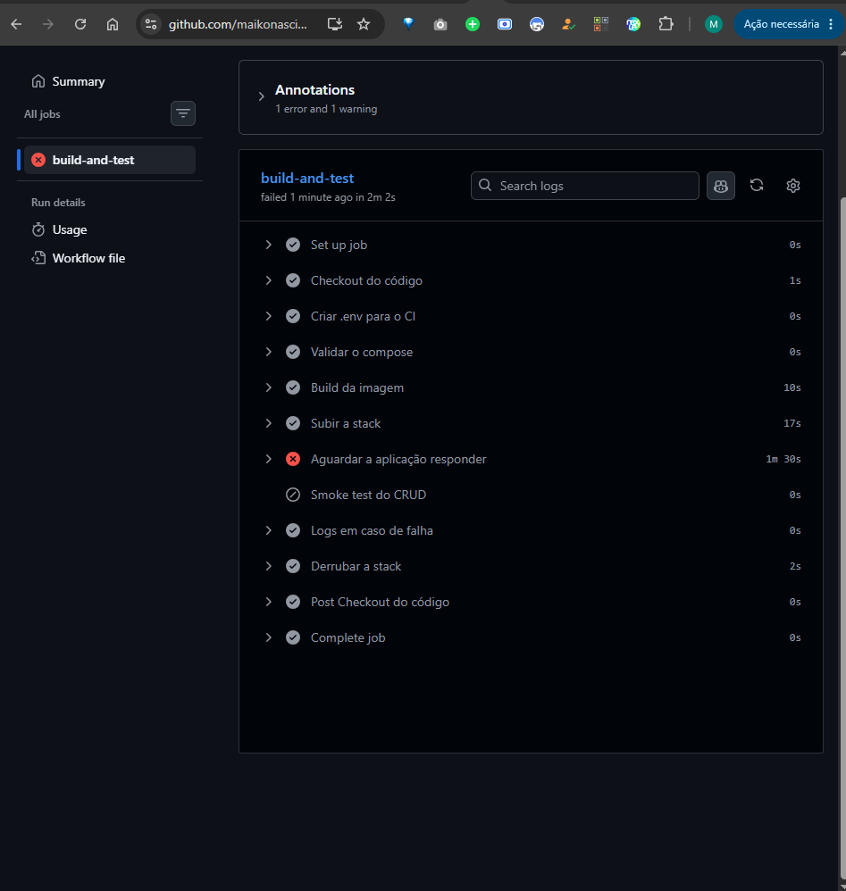
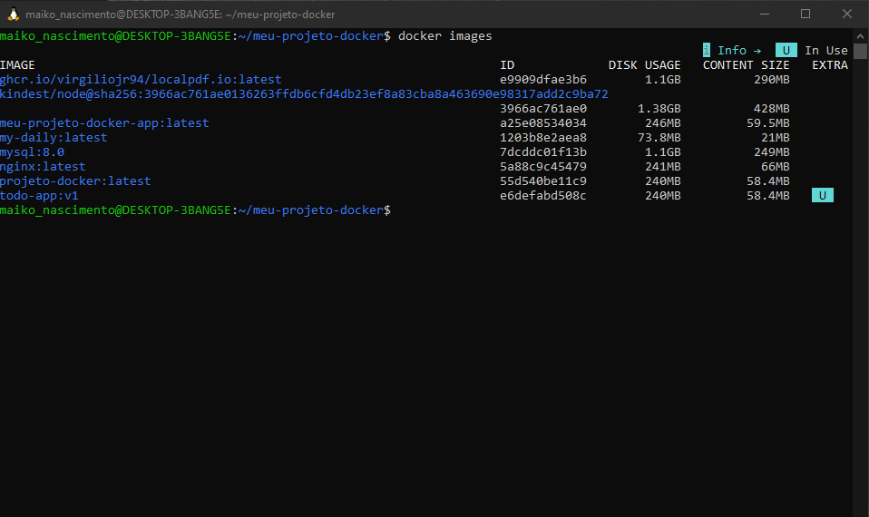
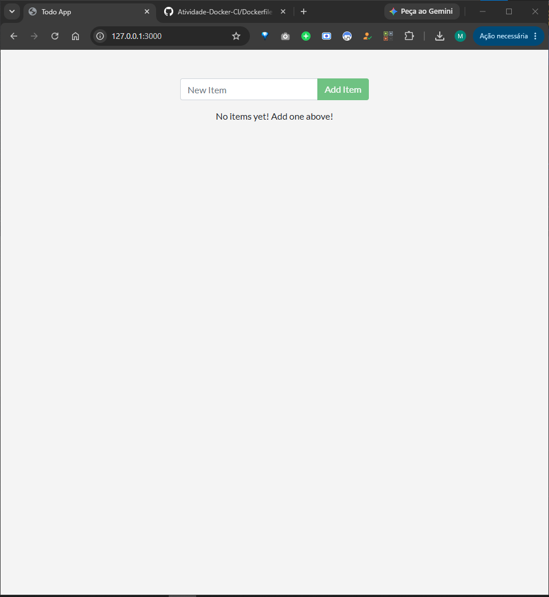
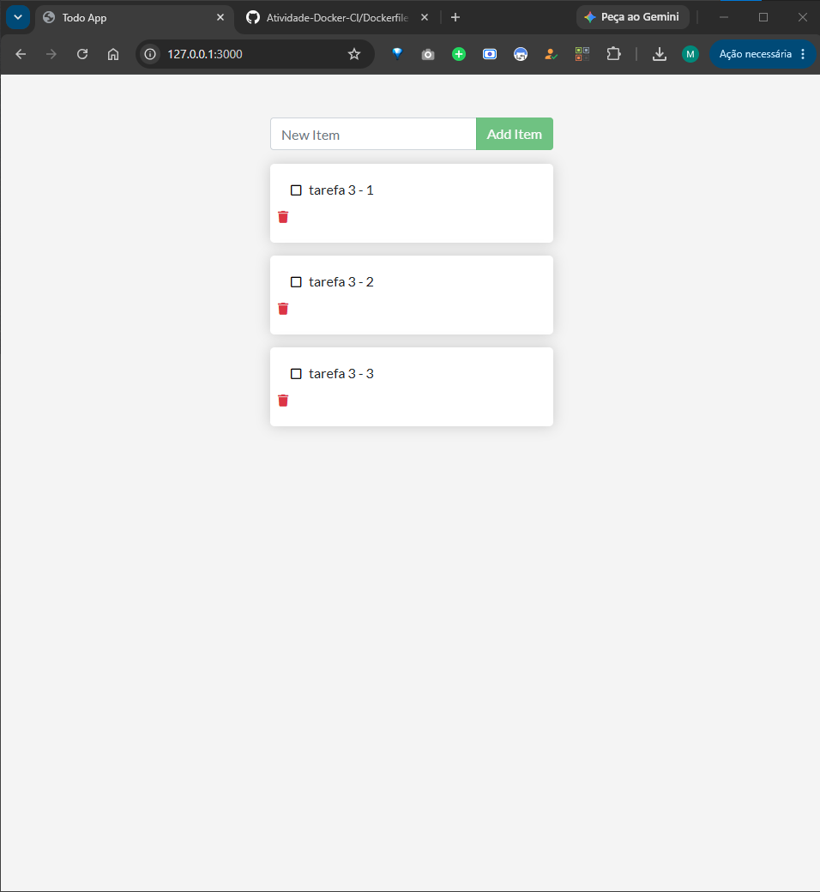
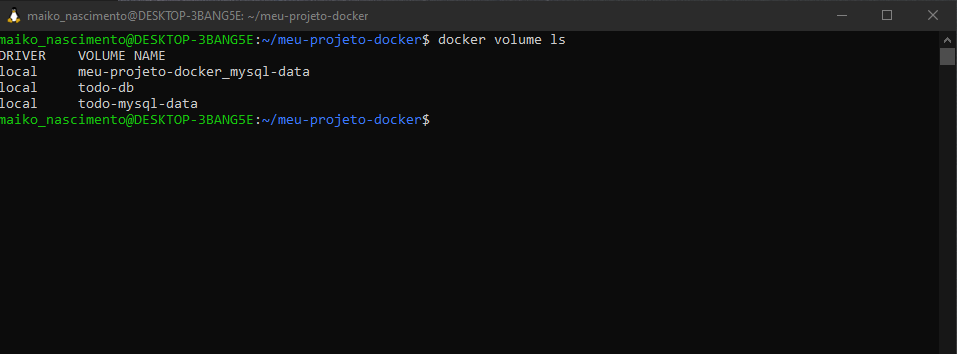

# Atividade Docker + CI

**Aluno(a):** Maiko Machado do Nascimento  
**Turma:** Noturno  
**Data:** 28/07/2026  
**Aplicação:** docker/meu-projeto-docker

---

# 1. Como executar este projeto

```bash
git clone https://github.com/maikonascimento/meu-projeto-docker.git
cd meu-projeto-docker
cp .env.example .env
docker compose up -d --build
```

Acesse:

```
http://localhost:3000
```

Para derrubar os containers:

```bash
docker compose down
```

Para remover containers e volumes:

```bash
docker compose down -v
```

---

# 2. Imagem e Dockerfile Multi-stage

**Estágios utilizados**

- Builder
- Runtime

**Imagem base**

```
node:20-alpine
```

**Usuário de execução**

```
node (não-root)
```

**Tamanho final da imagem**

Aproximadamente **240 MB**.

### Por que o multi-stage ajuda?

O multi-stage permite separar a etapa de compilação da etapa de execução, gerando uma imagem final menor, mais segura e contendo apenas os arquivos necessários para executar a aplicação.

## Print 1 – Build + docker images



## Print 2 – Aplicação rodando



---

# 3. Volumes e Persistência

**Volume utilizado**

```
todo-mysql-data
```

Montado no diretório de dados do MySQL para manter o banco persistente.

## Print 3 – Sem volume



## Print 4 – Com volume



### Diferença entre docker compose down e docker compose down -v

- **docker compose down** remove apenas containers e rede, preservando os volumes.
- **docker compose down -v** remove também os volumes, apagando todos os dados persistidos.

---

# 4. Rede

**Rede criada**

```
todo-net
```

**Serviços conectados**

- todo
- mysql

### A porta do banco está exposta ao host?

Não.

O banco permanece acessível apenas pela rede interna do Docker, aumentando a segurança da aplicação.

### Por que o app consegue chamar o host mysql sem saber o IP?

Porque o Docker Compose cria automaticamente um DNS interno, permitindo que os containers se comuniquem utilizando o nome do serviço.

## Print 5 – docker network inspect



## Print 6 – Dados no MySQL

```sql
SELECT * FROM todo_items;
```



---

# 5. Docker Compose

## Serviços

- todo
- mysql

## Rede

```
todo-net
```

## Volume

```
todo-mysql-data
```

## Healthcheck

Configurado para o serviço **mysql**.

## depends_on

Utilizando:

```yaml
condition: service_healthy
```

## Variáveis sensíveis

As variáveis são carregadas pelo arquivo:

```
.env
```

O arquivo `.env` não é versionado e existe um modelo em:

```
.env.example
```

## Print 7 – docker compose ps



---

# 6. Integração Contínua (GitHub Actions)

Workflow:

```
.github/workflows/ci.yml
```

### Gatilhos

- push
- pull_request

### O pipeline realiza

1. Validação do Docker Compose;
2. Build da imagem;
3. Inicialização da stack;
4. Aguarda a aplicação responder;
5. Executa um Smoke Test da aplicação;
6. Derruba a stack.

## Print 8 – Execução verde



---

# 7. Quebra proposital do CI

### O que foi quebrado

Foi realizada uma alteração proposital para impedir que a aplicação respondesse corretamente durante a etapa de verificação do pipeline.

### Erro apresentado

```
Process completed with exit code 1.
```

### Como o CI reagiu

O pipeline falhou na etapa:

```
Aguardar a aplicação responder
```

pois a aplicação não ficou disponível dentro do tempo esperado.

### Como foi corrigido

A alteração foi revertida, permitindo que a aplicação voltasse a responder normalmente e o pipeline fosse executado com sucesso.

### Pull Request

```
https://github.com/[usuario]/meu-projeto-docker/pull/[numero]
```

## Print 9 – Execução vermelha



---

# 8. Dificuldades e Aprendizados

Durante a atividade, a principal dificuldade foi compreender a comunicação entre os containers e a persistência dos dados utilizando volumes. Também foi necessário entender o funcionamento do Docker Compose e do pipeline do GitHub Actions. Após concluir a atividade, ficou mais claro como organizar aplicações em containers, utilizar redes internas, persistir dados e automatizar testes através da integração contínua.

---

# 9. Checklist

- [x] Dockerfile multi-stage funcionando
- [x] .dockerignore presente
- [x] Container executando como usuário não-root
- [x] Volume nomeado com persistência demonstrada
- [x] Rede nomeada
- [x] Banco não exposto ao host
- [x] compose.yaml sobe toda a aplicação
- [x] .env no .gitignore
- [x] .env.example versionado
- [x] CI funcionando
- [x] Quebra proposital do CI documentada
- [x] Prints incluídos


---

# CD — Publicação no Docker Hub

**Usuário do Docker Hub:** maikonascimento

**Imagem publicada:**

```text
maikonascimento/meu-projeto-docker:latest
```

**Link da imagem no Docker Hub:**

```
https://hub.docker.com/r/maikonascimento/meu-projeto-docker
```

## Disparo do Workflow

O workflow é executado automaticamente sempre que ocorre um **push** na branch **main**.

**Arquivo do workflow:**

```text
.github/workflows/cd.yml
```

---

# Workflow de CD

O pipeline de CD realiza automaticamente as seguintes etapas:

1. Baixa o código do repositório.
2. Faz login no Docker Hub utilizando Secrets do GitHub.
3. Constrói a imagem Docker.
4. Publica a imagem no Docker Hub utilizando a tag `latest`.

---

# Prints

## Print 1 — Token criado no Docker Hub

> Inserir imagem:
>
> `docs/imagens/cd-print1.png`

---

## Print 2 — Secrets cadastrados no GitHub

Secrets utilizados:

- DOCKERHUB_USERNAME
- DOCKERHUB_TOKEN

> Inserir imagem:
>
> `docs/imagens/cd-print2.png`

---

## Print 3 — Workflow de CD executando com sucesso

Workflow:

```
CD - Publicar no Docker Hub
```

Status:

```
Success
```

> Inserir imagem:
>
> `docs/imagens/cd-print3.png`

---

## Print 4 — Imagem publicada no Docker Hub

Imagem publicada:

```text
maikonascimento/meu-projeto-docker:latest
```

> Inserir imagem:
>
> `docs/imagens/cd-print4.png`

---

## Print 5 — Download da imagem

Comando utilizado:

```bash
docker pull seu-usuario/meu-projeto-docker:latest
```

Para executar:

```bash
docker run -p 3000:3000 seu-usuario/meu-projeto-docker:latest
```

> Inserir imagem:
>
> `docs/imagens/cd-print5.png`

---

# Respostas

## 1. O que é o Docker Hub?

O Docker Hub é um repositório online de imagens Docker. Ele funciona como um catálogo onde desenvolvedores podem armazenar, compartilhar e distribuir imagens de containers, permitindo que qualquer pessoa faça o download e execute uma aplicação utilizando apenas um comando.

---

## 2. Diferença entre CI e CD

O **CI (Continuous Integration)** verifica automaticamente se o projeto está funcionando corretamente sempre que há alterações no código, executando validações e testes.

O **CD (Continuous Delivery/Deployment)** complementa esse processo, publicando automaticamente a imagem Docker aprovada no Docker Hub, tornando-a disponível para utilização por qualquer ambiente.

---

## 3. Por que usar Token e Secrets em vez de usuário e senha no `cd.yml`?

Tokens e Secrets aumentam a segurança da aplicação, pois impedem que informações sensíveis fiquem gravadas no código-fonte. Os Secrets são armazenados de forma protegida pelo GitHub e podem ser alterados ou revogados sem expor a senha da conta.

---

## 4. O que significa a tag `latest`?

A tag **latest** representa a versão mais recente da imagem publicada. Quando nenhum número de versão é informado durante o download da imagem, o Docker utiliza automaticamente a imagem marcada com essa tag.

---

# Conclusão

Com a implementação do pipeline de CD, a aplicação passou a ser publicada automaticamente no Docker Hub após cada envio de código para a branch `main`. Dessa forma, a distribuição da aplicação torna-se automatizada, padronizada e reproduzível, bastando executar um `docker pull` para obter a versão mais recente da imagem.
